% Apache Kafka
% Created by [Apache Kafka](https://github.com/apache/kafka)
% [Balhau](http://codecorner.balhau.net)

# In the beginning of time

## The dinossaur era
The web was formed by *http server* responding with static content

## The three cake layer

* After some time, web applications become *dynamic*
* With a three layer architecture

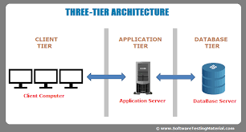

## But then Internet had grown...

## The monolith

Monolithic approach had some drawbacks

* Difficult to maintain
* Difficult to scale

## Microservices to the rescue

To overcome the scalling and mantainability issues monoliths start to be broken into a microservice architecture
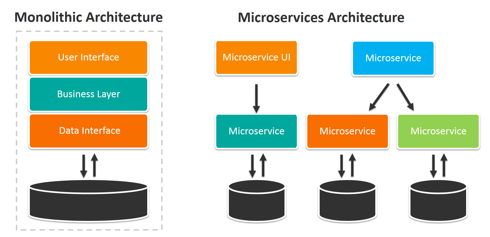

## The HTTP contract

Orchestraction of microservices follow a [REST](https://en.wikipedia.org/wiki/Representational_state_transfer)
approach

## Microservice architecture

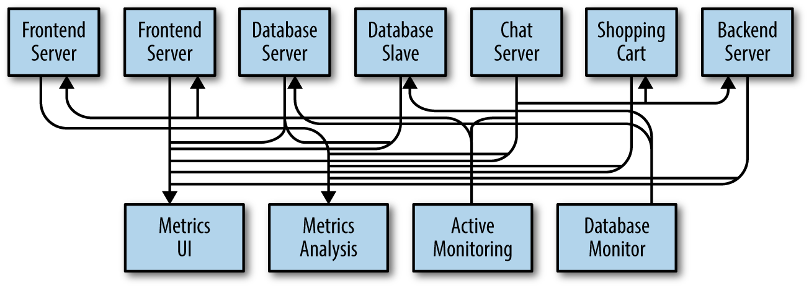

## But then...

Microservices are heterogeneous

* Some are quick
* Others not so...

## Scale the slower ones

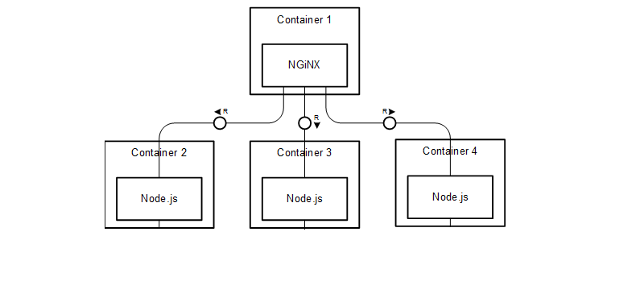

## But sometimes...

* You can't
* You don't need

## And the world went async

* Async REST contracts
* Fire and Forget

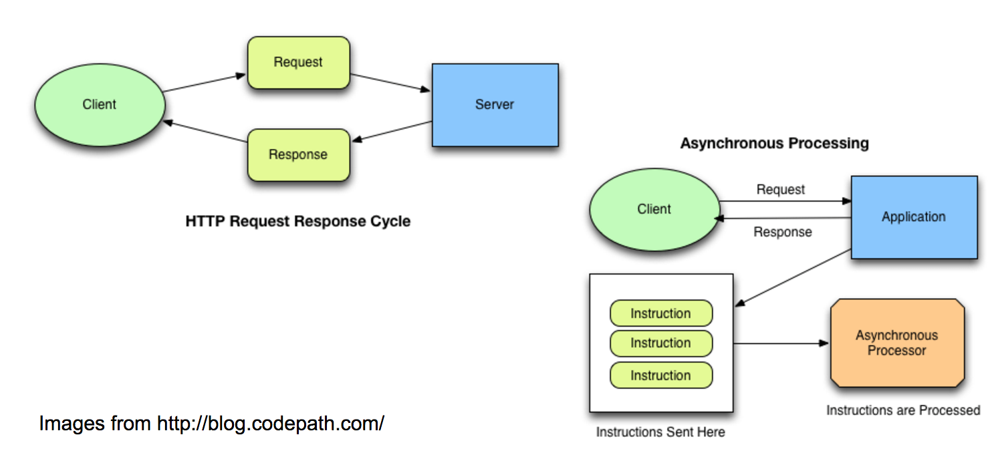

## And then the queue
Async solutions need a way to store the messages submited to processing

* First internal queues
    * But the internal queues had local visibility would not scale horizontally

## External queues
Orchestration of async microservices start using external queue services

* Enable multiple publishers
* Enable multiple consumers

## 
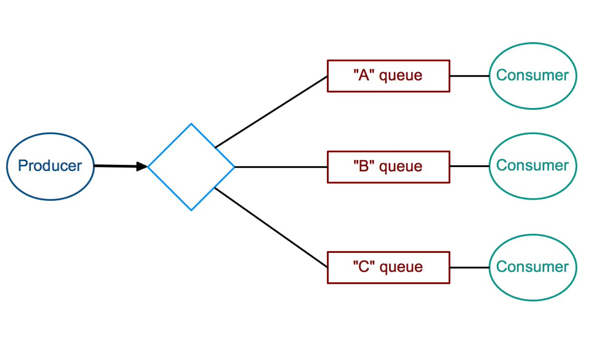

## The Queue Era

Several queue implementation mechanisms arrive to solve this

## But then things got messy...

## Queues...

* Don't scale horizontally
* Don't persist data easily
* Don't shard data easily
* Multiple publisher/subscriber is hard

## What is wrong then?

* Queues implementation are memory oriented, memory is volatile.
* Queue paradigm is based on the principle that one puts other gets
    * With multiple subscribers some of them fail... *some for very long*

## Reality

Multiple pub/sub is hard to do on queues

# ... and then what?

## Wouldn't be nice if...

* Some mechanism solve the queue drawbacks?
* Even better if this already exist...

## It exists!

* Yes, at least from [1981](https://people.eecs.berkeley.edu/~brewer/cs262/SystemR.pdf)
* Its called log 

## Cool, but...

* What is a log?
* How does it solve the problems?

## The Log
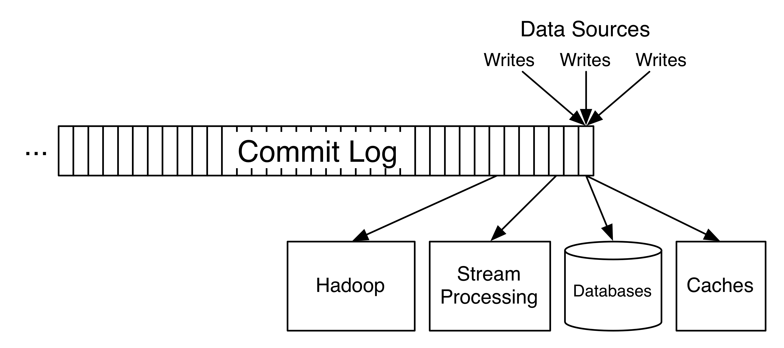

## The key idea

* On queues one *puts* another *picks*
* On logs on *writes* another *reads*

## The write/read

The log write/read (as opposed to put/get) has several advantages over queues

* Don't need synchronization between clients because we don't remove as soon as all
consumer read the message
* If another consumer wants to join he will have the messages to *read*.
    With queues they were consumed and hence not available
* Durability is straightforward, everything is on disc

## But will it scale?

Not this simple log

## But a distributed log will

* Is there anyone?
* This is exactly what [Apache Kafka](https://kafka.apache.org/) is

## What is *Apache Kafka*?

* Apache Kafka® is a distributed streaming platform

## What does this even mean?

## A streaming platform has three key capabilities

* Publish and subscribe to streams of records, similar to a message 
queue or enterprise messaging system
* Store streams of records in a fault-tolerant durable way.
* Process streams of records as they occur

## Why the name *Kafka*?

## 
*I thought that since Kafka was a system optimized for writing, using a writer’s name
would make sense. I had taken a lot of lit classes in college and liked Franz Kafka. Plus
the name sounded cool for an open source project.
So basically there is not much of a relationship.*

[Jay Kreps](https://www.linkedin.com/in/jaykreps/)

## Kafka Architecture

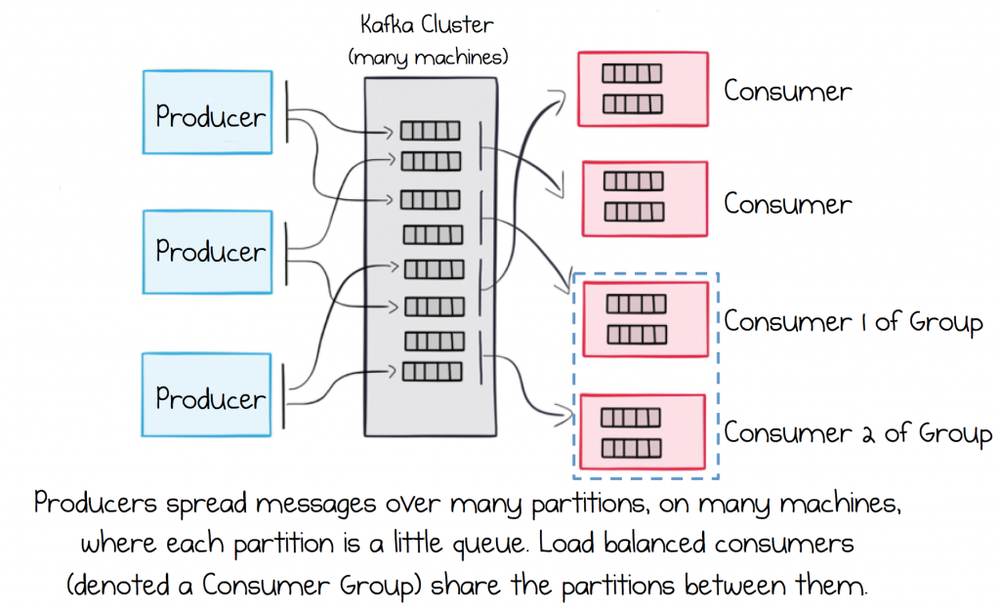

## Kafka Topic

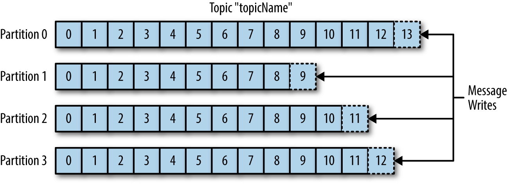

## The consumer group

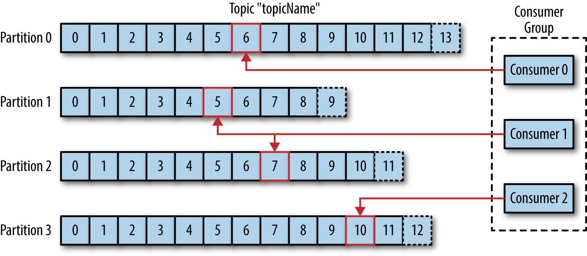

## 

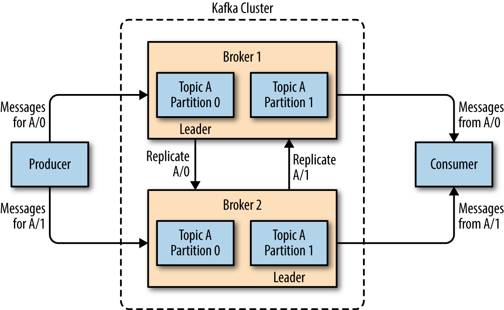

# Building Kafka data Pipelines
Some principles we should *take care*

## Timeliness 

Producers and consumers will have different *timeliness* requirements

* *Look at Kafka in this context is that it acts as a giant buffer that 
decouples the time-sensitivity requirements between producers and consumers.*

## Reliability

Validate your delivery guarantees

* Kafka gives you at *least semantics*
* With the help of ACID datastores you can achieve *exactly once* semantics

## High and Varying throughput

Kafka *push/pull* model enables you to decouple producer and consumer throughput, leverage this to:

* Avoid the implementation of *backpressure* mechanisms
* Scale easily
* Build a system that is resilient to sudden bursts of data

## Contracts 

The data in kafka topics will need to evolve.
Choose your data-types that give you the flexibility to evolve your contracts

* [Avro](https://avro.apache.org/) and [Protocol Buffers](https://developers.google.com/protocol-buffers/) are two good examples

## Transformations

Give preference to ELT instead of ETL 

* With *Extract Transform Load* sometimes we endup with partial data which leads to flaky messy data pipelines
* With *Extract Load Transform* we try preserving the context presented in the raw data as much as possible
    * This leads to less messy data pipelines

## Security

Analyse your security requirements.
Do we have sensitive topics we don't wan't everyone connecting to?

* Use Kafka [SASL](https://en.wikipedia.org/wiki/Simple_Authentication_and_Security_Layer) authorization mechanism

## Failure Handling

Plan for failure in advance

* Analyse your failure scenarios
* Find your *recoverable* *non recoverable* errors and plan accordingly

## Coupling and Agility

* Avoid *Ad-Hoc* pipelines
    * Plan your data pipeline in advance
    * Avoid reactive design 
    * Creating consumers producers as needed
* Avoid Loss of metadata
    * Preserve schema information 
    * For evolutionary contracts purpose
* Avoid extreme processing
    * Extreme processing hurts agility
    * Allow downstream components do the decisions

# Cross-Cluster Architectures

## Why cross-cluster architectures?

## 

* Regional and central clusters
* Redundancy (data recovery)
* Cloud migrations

## Multi cluster architectures

## 
### Some limitations

* High Latencies
    * Latency increases lineary with distance and the number of ops
    in the network
* Limited bandwidh
    * WANs have less bandwith than intra datacenter comunications
* Higher costs
    * Due the need to improve bandwidth and latency
    requirements

## Hub-and-Spokes Architecture

## 

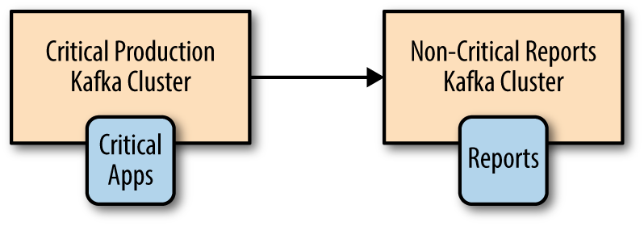	

## 
### Advantages

* Leverage of data locality by producing always to the local cluster
* Data mirrowed once to the central cluster
* Simple to deploy, mirror and monitor

## 
### Disadvantages

* Data locality makes hard for local processor in local *A* to access
data from local *B*

## Active-Active Architecture

## 

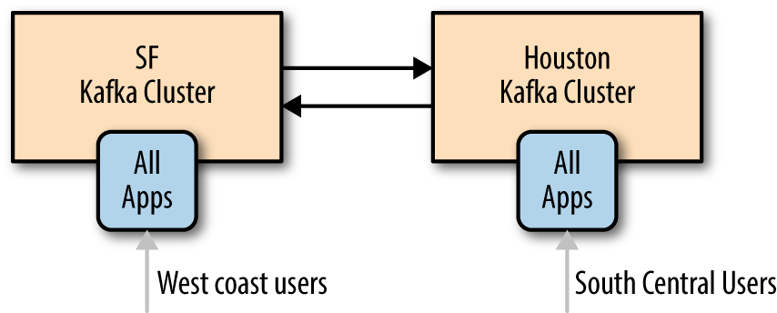

## 
### Advantages

* Leverage of data locality without scacrificing functionality
due to limited availability of data
* Redundancy and resilience
* Cost effective

## 
### Disadvantages

* Hard to manage conflicting async read/write operations from different
locations
* Careful need to avoid endless replication of data

## Active-Passive Architecture

## 
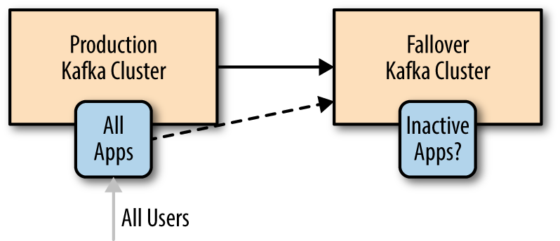

## 
### Advantages

* Simplicity of implementation

## 
### Disadvantages

* Waste of resources
    * Since it is not actively serving traffic
* Failover between kafka clusters harder than it looks