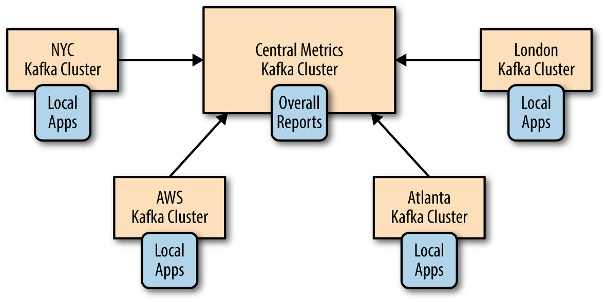
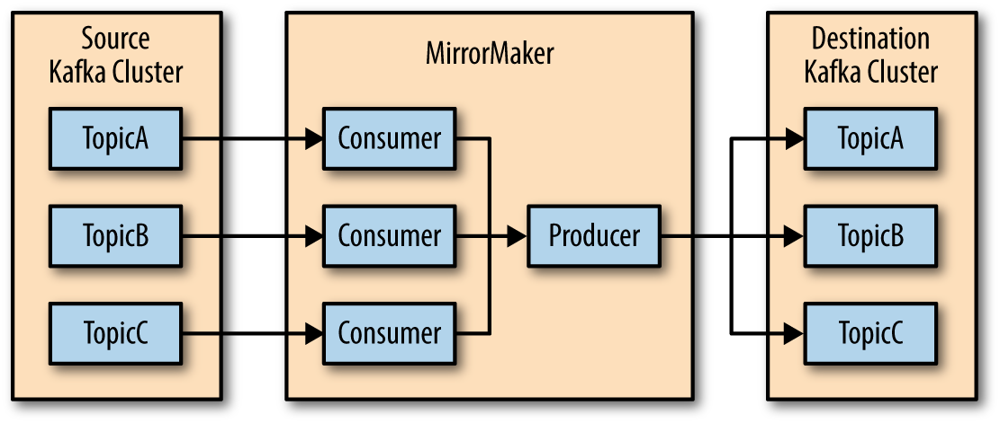

% Apache Kafka
% Created by [Apache Kafka](https://github.com/apache/kafka)
% [Balhau](http://codecorner.balhau.net)

# In the beginning of time

## The dinossaur era
The web was formed by *http server* responding with static content

## The three cake layer

* After some time, web applications become *dynamic*
* With a three layer architecture


## But then Internet had grown...

## The monolith

Monolithic approach had some drawbacks

* Difficult to maintain
* Difficult to scale

## Microservices to the rescue

To overcome the scalling and mantainability issues monoliths start to be broken into a microservice architecture


## The HTTP contract

Orchestraction of microservices follow a [REST](https://en.wikipedia.org/wiki/Representational_state_transfer)
approach

## Microservice architecture


## But then...

Microservices are heterogeneous

* Some are quick
* Others not so...

## Scale the slower ones


## But sometimes...

* You can't
* You don't need

## And the world went async

* Async REST contracts
* Fire and Forget


## And then the queue
Async solutions need a way to store the messages submited to processing

* First internal queues
    * But the internal queues had local visibility would not scale horizontally

## External queues
Orchestration of async microservices start using external queue services

* Enable multiple publishers
* Enable multiple consumers

## 


## The Queue Era

Several queue implementation mechanisms arrive to solve this


## But then things got messy...

## Queues...

* Don't scale horizontally
* Don't persist data easily
* Don't shard data easily
* Multiple publisher/subscriber is hard

## What is wrong then?

* Queues implementation are memory oriented, memory is volatile.
* Queue paradigm is based on the principle that one puts other gets
    * With multiple subscribers some of them fail... *some for very long*

## Reality

Multiple pub/sub is hard to do on queues


# ... and then what?

## Wouldn't be nice if...

* Some mechanism solve the queue drawbacks?
* Even better if this already exist...

## It exists!

* Yes, at least from [1981](https://people.eecs.berkeley.edu/~brewer/cs262/SystemR.pdf)
* Its called log 

## Cool, but...

* What is a log?
* How does it solve the problems?

## The Log


## The key idea

* On queues one *puts* another *picks*
* On logs on *writes* another *reads*

## The write/read

The log write/read (as opposed to put/get) has several advantages over queues

* Don't need synchronization between clients because we don't remove as soon as all
consumer read the message
* If another consumer wants to join he will have the messages to *read*.
    With queues they were consumed and hence not available
* Durability is straightforward, everything is on disc

## But will it scale?

Not this simple log

## But a distributed log will

* Is there anyone?
* This is exactly what [Apache Kafka](https://kafka.apache.org/) is

## What is *Apache Kafka*?

* Apache Kafka® is a distributed streaming platform

## What does this even mean?

## A streaming platform has three key capabilities

* Publish and subscribe to streams of records, similar to a message 
queue or enterprise messaging system
* Store streams of records in a fault-tolerant durable way.
* Process streams of records as they occur

## Why the name *Kafka*?

## 
*I thought that since Kafka was a system optimized for writing, using a writer’s name
would make sense. I had taken a lot of lit classes in college and liked Franz Kafka. Plus
the name sounded cool for an open source project.
So basically there is not much of a relationship.*

[Jay Kreps](https://www.linkedin.com/in/jaykreps/)

## Kafka Architecture


## Kafka Topic


## The consumer group


## 


# Building Kafka data Pipelines
Some principles we should *take care*

## Timeliness 

Producers and consumers will have different *timeliness* requirements

* *Look at Kafka in this context is that it acts as a giant buffer that 
decouples the time-sensitivity requirements between producers and consumers.*

## Reliability

Validate your delivery guarantees

* Kafka gives you at *least semantics*
* With the help of ACID datastores you can achieve *exactly once* semantics

## High and Varying throughput

Kafka *push/pull* model enables you to decouple producer and consumer throughput, leverage this to:

* Avoid the implementation of *backpressure* mechanisms
* Scale easily
* Build a system that is resilient to sudden bursts of data

## Contracts 

The data in kafka topics will need to evolve.
Choose your data-types that give you the flexibility to evolve your contracts

* [Avro](https://avro.apache.org/) and [Protocol Buffers](https://developers.google.com/protocol-buffers/) are two good examples

## Transformations

Give preference to ELT instead of ETL 

* With *Extract Transform Load* sometimes we endup with partial data which leads to flaky messy data pipelines
* With *Extract Load Transform* we try preserving the context presented in the raw data as much as possible
    * This leads to less messy data pipelines

## Security

Analyse your security requirements.
Do we have sensitive topics we don't wan't everyone connecting to?

* Use Kafka [SASL](https://en.wikipedia.org/wiki/Simple_Authentication_and_Security_Layer) authorization mechanism

## Failure Handling

Plan for failure in advance

* Analyse your failure scenarios
* Find your *recoverable* *non recoverable* errors and plan accordingly

## Coupling and Agility

* Avoid *Ad-Hoc* pipelines
    * Plan your data pipeline in advance
    * Avoid reactive design 
    * Creating consumers producers as needed
* Avoid Loss of metadata
    * Preserve schema information 
    * For evolutionary contracts purpose
* Avoid extreme processing
    * Extreme processing hurts agility
    * Allow downstream components do the decisions


# Cross-Cluster Architectures

## Why cross-cluster architectures?

## 

* Regional and central clusters
* Redundancy (data recovery)
* Cloud migrations

## Multi cluster architectures

## 
### Some limitations

* High Latencies
    * Latency increases lineary with distance and the number of ops
    in the network
* Limited bandwidh
    * WANs have less bandwith than intra datacenter comunications
* Higher costs
    * Due the need to improve bandwidth and latency
    requirements


## Hub-and-Spokes Architecture



## 

	

## 
### Advantages

* Leverage of data locality by producing always to the local cluster
* Data mirrowed once to the central cluster
* Simple to deploy, mirror and monitor

## 
### Disadvantages

* Data locality makes hard for local processor in local *A* to access
data from local *B*

## Active-Active Architecture

## 


## 
### Advantages

* Leverage of data locality without scacrificing functionality
due to limited availability of data
* Redundancy and resilience
* Cost effective

## 
### Disadvantages

* Hard to manage conflicting async read/write operations from different
locations
* Careful need to avoid endless replication of data

## Active-Passive Architecture

## 


## 
### Advantages

* Simplicity of implementation

## 
### Disadvantages

* Waste of resources
    * Since it is not actively serving traffic
* Failover between kafka clusters harder than it looks

## 
### Unplanned failover strategies

## 
### Restart offset after failover

## 
#### Auto offset reset

* Deal with duplicate or data loss

## 
#### Replicate offsets topic


## 
#### Caveats

* The replication of offsets will not work in some cases
    * Some compromises must be done

## 
#### Time-based failover

* Consumers with version *0.10* or higher have a timestamp in the message
    * This can be used to control the reprocessing
* However you need to deal with data loss or duplicates
    * The window is much smaller though 

## 
#### External offset mapping

* Instead of replication of offsets we can map them 
(for example to a database)
    * The window to loss/duplicate of data is even lesser
    * Higher complexity though

## 
#### After the failover

* Tempting to switch active to passive and resync
    * This is tricky
* Better to
    * Switch from active to passive
    * Erase the old active cluster 
    * Start sync with new active

## 
#### Stretch Cluster Architecture

* One cluster spread across several datacenters

## 
#### Advantages

* Synchronous replication
* All datacenters are being used (less waste of resources)
* Protection against datacenter failures (not application failures)

## 
#### Disadvantages

* This architecture needs three datacenters for zookeepers
    * If we only have two dc for zookeepers you'll not be able to reach
    quorum
* Latency and bandwidth are high because of zookeeper sensitivity

## 
### Mirror Maker

A tool to replicate kafka topics between clusters

## 




## 
#### Running Mirror Maker

```
bin/kafka-mirror-maker 
--consumer.config etc/kafka/consumer.properties 
--producer.config etc/kafka/producer.properties 
--new.consumer -num.streams=2 
--whitelist ".*"
```

## 
#### Mirror Maker in production

* If using containers run it inside one
    * Better scaling
    * Better failover control
* Monitor the *Lag*
* Tune your Mirror Maker cluster
    * You can use *kafka-performance-producer*
    to help
    * Target *lag SLOs*

## 
#### Other replication tools

* [uReplicator](https://github.com/uber/uReplicator)
* [Confluent Replicator](https://docs.confluent.io/current/connect/kafka-connect-replicator/index.html)
* Here in PPB we usually use a *Storm Topology*
    * It has all the failover and scalling capabilities we need

# Kafka Producers

## 


## 
### Setting up a Kafka Producer

## 
#### Configurations needed

* bootstrap-servers - List of kafka brokers
* key.serializer - Class responsible for *key* serialization
* value.serializer -  Class responsible for *payload* serialization

## 
#### Java example

```
Properties kafkaProps = new Properties();

kafkaProps.put(
    "bootstrap.servers", 
    "broker1:9092,broker2:9092"
);
kafkaProps.put(
    "key.serializer",
    "org.apache.kafka.common.serialization.StringSerializer"
);
kafkaProps.put(
    "value.serializer",
    "org.apache.kafka.common.serialization.StringSerializer"
);

KafkaProducer producer = new KafkaProducer<String, String>(kafkaProps);
```

## 
#### Publishing strategies

* Fire and Forget
* Synchronous send
* Asynchronous send

## 
##### Fire and forget

```
ProducerRecord<String, String> record = new ProducerRecord<>(
    "CustomerCountry", "Precision Products", "France"
);
try {
    producer.send(record);
} catch (Exception e) {
    e.printStackTrace();
}
```

## 
##### Synchronous send
```
ProducerRecord<String, String> record = new ProducerRecord<>(
    "CustomerCountry", "Precision Products", "France"
);
try {
    producer.send(record).get();
} catch (Exception e) {
    e.printStackTrace();
}
```

## 
##### Async send

* You define a callback to handle the message result

```
private class DemoProducerCallback implements Callback {
    @Override
    public void onCompletion(
        RecordMetadata recordMetadata, 
        Exception e
    ){
        if (e != null) {
            e.printStackTrace();
        }
    }
}
```

## 

* And set this callback in the *send* method
```
ProducerRecord<String, String> record = new ProducerRecord<>(
    "CustomerCountry", "Precision Products", "France"
);
try {
    producer.send(record,new DemoProducerCallback());
} catch (Exception e) {
    e.printStackTrace();
}
```
## 
### Producers configurations

## 
#### acks

* acks = 0 -- Producer will not wait for broker reply
* acks = 1 -- Producer will receive notification as soon as leader replica acknowledge
the message
* acks = all --Producer will receive notification as soon as all in-sync replicas
receive the message

## 
#### Acks trade-off

* The less you care for broker *acks*, the higher the risk for loss of messages
* The less you care for broker *acks*, the higher the throughput of your system

## 
##### Buffer memory (buffer.memory)

* Buffer used by the producer
* If the buffer is filled and no more messages are possible to hold,
an exception is thrown
* Filling of buffer usually means the broker is not being able to keep up 
with production rate

## 
##### Compression Type (compression.type)
						
* By default messages are uncompressed
* This parameter can be set to
    * [Snappy](https://en.wikipedia.org/wiki/Snappy_(compression))
    * [LZ4](https://en.wikipedia.org/wiki/LZ4_(compression_algorithm))
    * [Gzip](https://en.wikipedia.org/wiki/Gzip)

## 
#### Retries 
						
* Number of retries that the producer will atempt, before throwing an exception
* Producer will hold 100ms by default between atempts
    * This can be overrided with *retry.backoff.ms* parameter

## 
#### Batch Size (batch.size)

* For performance reasons the produces batch the messages to be send 
to a specific partition
* This parameter specifies the size of this buffer in bytes (not in messages)

## 
#### Linger milliseconds (linger.ms)

* Latency is a concern. We need a way to guarantee that messages are sent even
if the batch buffer is not completly filled
* *linger.ms* is the time in milliseconds that the producer will wait
for batch buffer completion
* After this time the messages on the batch are sent anyway

## 
#### Client ID (client.id)

* *client.id* is just a tag sent by the producer for the brokers to be able
to identify the client
    * Used for logging, metrics and quotas

## 
#### Max Inflight Requests/Connection (max.in.flight.requests.per.connection)

* This controls the maximum number of pending requests in flight
    * Increasing this will
        * Increase throughput
        * Increase memory footprint
    * Setting to 1 will 
        * Guarantee that messages will be sent to kafka in order
        * Sacrifice throughput

## 
#### Timeouts

* *timeout.ms* -- Controls the time the broker will wait for in-sync replicas to acknowledge the message
in order to meet the acks configuration. The broker will return an error if the time
elapses without the necessary acknowledgments

## 

* *request.timeout.ms* -- Controls how long the producer will wait for a reply from the server
when sending data
* *metadata.fetch.timeout.ms* -- Controls how long will wait while requesting 
metadata such as the current leaders for the partitions

## 
#### Max Block milliseconds (max.block.ms)

* Controls how long the producer will block when calling *send()* and
when explicitly requesting metadata via *partitionsFor()*
* When this timeout is reached an exception is thrown

## 
#### Max Request Size (max.request.size)

* This parameter sets the maximum size of a produce request
    * Note that most broker configuration will not accept messages with payload 
    higher than 1MB (*message.max.bytes*)

## 
#### Receive/Send Buffer bytes (receive.buffer.bytes/send.buffer.bytes)

* By default they are set with -1 which means use the default OS 
configurations
    * We should review this parameter and increase it when publishing/consuming from/to
    different datacenters

#### Serialize with Avro


## 

```
Properties props = new Properties();
props.put("bootstrap.servers", "localhost:9092");
props.put(
    "key.serializer",
    "io.confluent.kafka.serializers.KafkaAvroSerializer"
);
props.put(
    "value.serializer",
    "io.confluent.kafka.serializers.KafkaAvroSerializer"
);

props.put("schema.registry.url", schemaUrl);
String topic = "customerContacts";
int wait = 500;
Producer<String, Customer> producer = new KafkaProducer<String,
Customer>(props);
while (true) {
    Customer customer = CustomerGenerator.getNext();
    System.out.println("Generated customer " +
    customer.toString());
    ProducerRecord<String, Customer> record =
        new ProducerRecord<>(
            topic, customer.getId(), 
            customer
    );
    producer.send(record);
```

## 
#### Other payloads options

* [JSON](https://www.json.org/)
* [Protocol Buffers](https://developers.google.com/protocol-buffers/)
* [Thrift Protocol](https://thrift.apache.org/)

* For more analysis on pros and cons of these different protocols you can check 
[chapter 4 of DDIA](https://dataintensive.net/)


# Kafka Consumers

## 


## 


## 


## 


## 
### Same Consumer Group

* The same consumer group enable easy implementation of
    * Load balancing
    * Failover mechanisms

## 
### Different Consumer Group

* Different consumer groups enables
    * Independent consumption from different applications
    * Better scalling capabilities

## 
### A simple java consumer

```
Properties props = new Properties();
props.put("bootstrap.servers", "broker1:9092,broker2:9092");
props.put("group.id", "CountryCounter");

props.put(
    "key.deserializer",
    "org.apache.kafka.common.serialization.StringDeserializer"
);
props.put(
    "value.deserializer",
    "org.apache.kafka.common.serialization.StringDeserializer"
);

KafkaConsumer<String, String> consumer = new KafkaConsumer<String,
String>(props);
```    

## 
#### Subscribing a topic
```
consumer.subscribe(
    Collections.singletonList(
        "customerCountries"
    )
);
```

## 
#### Subscribing by pattern
```
consumer.subscribe(
    Collections.singletonList(
        "topic.type.*"
    )
);
```

## 
#### The consumer loop
```
try {
    while (true) {
        ConsumerRecords<String, String> records = consumer.poll(100);
        for (ConsumerRecord<String, String> record : records)
        {
            log.debug("
                topic = %s, 
                partition = %s, 
                offset = %d,
                customer = %s, 
                country = %s\n",
                record.topic(), 
                record.partition(), 
                record.offset(),
                record.key(), 
                record.value()
            );
            
            int updatedCount = 1;
            
            if (custCountryMap.countainsValue(record.value())) {
                updatedCount = custCountryMap.get(record.value()) + 1;
            }
        
            custCountryMap.put(record.value(), updatedCount)
            JSONObject json = new JSONObject(custCountryMap);
            System.out.println(json.toString(4))
        }
    }
} finally {
    consumer.close();
}
```

## 
#### Notes on thread safety
						
* You can’t have multiple consumers that belong to the same group
in one thread
* You can’t have multiple threads safely using the same consumer
* One consumer per thread is the rule
* To run multiple consumers in the same group in one application, you will
need to run each in its own thread
* See more details in [this confluent tutorial](https://www.confluent.io/blog/tutorial-getting-started-with-the-new-apache-kafka-0-9-consumer-client/)

## 
### Main consumer configurations

## 
#### Fetch minimum bytes (fetch.min.bytes)

* This will specify the buffer in bytes that will be allocated to fetch records
* This will impact the amount of data we will be able to fetch on each `pool()`
call
* Higher values will reduce the amount of pool calls because less *forth and back* 
communication is needed

## 
#### Fetch maximum wait (fetch.max.wait.ms)

* This parameter sets the maximum amount of time (in milliseconds) that
the request call can be blocked
* If the minimum bytes is not reached the data batched is returned anyway

## 
#### Max partition fetch bytes (max.partition.fetch.bytes)

* This controls the ammount of data sent by the broker on each partition
* The default is 1MB
    * This means that if you got 20 partitions you'll need 20Mb of memory
* This parameter must be set accordingly with the broker parameter *max.message.size*
    * Otherwise you can endup in a failure loop because you'll be not able to consume a message
    and will stuck in error

## 
#### Session Timeout milliseconds (session.timeout.ms)

* This parameter sets the maximum time that the consumer can be without comunication with
the coordinator
    * If the timeout is reached the coordinator will launch a rebalance to allocate partitions
    from this (now considered dead) consumer to other consumers in the group
* The parameter *heartbeat.interval.ms* defines the interval of heartbeats from the consumer

## 
#### Auto offset reset (auto.offset.reset)

* When no offset (or invalid) is found on the *__consumers* topic a
default policy is applied
    * *earliest* -- If set with this value it will start consuming from the beginning
    * *latest*   -- If set with this value it will start consuming from the most recent

## 
#### Auto commit (enable.auto.commit)

* This is a boolean parameter that will enable/disable the automatic submition of 
consumed offsets

## 
#### Partition Assignment Strategy (partition.assignment.strategy)

* This parameter holds the name of the class that will be responsible to
define the way partitions are assigned to consumers
* There are two default implementations
    * Range 
    * RoundRobin

## 
##### Range Partition Assignment Strategy
* Assigns to each consumer a consecutive subset of partitions
    from each topic it subscribes to
    * If consumers C1 and C2 are subscribed to two topics, T1 and
        T2, and each of the topics has three partitions, then C1 will be assigned partitions
        0 and 1 from topics T1 and T2, while C2 will be assigned partition 2 from those
        topics

## 
##### RoundRobin Partition Assignment Strategy

* Takes all the partitions from all subscribed topics and assigns them to consumers
sequentially, one by one
    * If C1 and C2 described previously used RoundRobin assignment, 
    C1 would have partitions 0 and 2 from topic T1 and partition 1 from
    topic T2. C2 would have partition 1 from topic T1 and partitions 0 and 2 from
    topic T2

## 
#### Client ID (client.id)
						
* The same purpose of the *client.id* parameter in the producer 
configuration

## 
#### Maximum pool records (max.poll.records)

* Will define the maximum amount of *ConsumerRecords* returned by *pool* call

## 
### Commits and offsets

## 
#### Can lead to

* Reprocessing of messages
* Loss of messages

## 
#### Reprocessing of messages


## 
#### Loss of messages


## 
#### Automatic Commit

* This will be done periodically with the highest value returned by *pool*
call
    * The period of submission is defined by the parameter *auto.commit.interval.ms*

## 
#### Manual sync commit

* Disable the automatic commit of offsets by setting the *auto.commit.offset* 
to *false*

## 

```
    ConsumerRecords<String, String> records = consumer.poll(100);
    for (ConsumerRecord<String, String> record : records){
        System.out.printf("
        topic = %s, 
        partition = %s, 
        offset =
        %d, customer = %s, 
        country = %s\n",
    record.topic(), 
    record.partition(),
    record.offset(), 
    record.key(), 
    record.value());
    }
    try {
        consumer.commitSync();
    } catch (CommitFailedException e) {
        log.error("commit failed", e)
    }
```

## 
#### Manual Async commit

```
consumer.commitAsync();
```

## 
##### Manual Async Commit with callback
```
consumer.commitAsync(new OffsetCommitCallback() {
    public void onComplete(
        Map<TopicPartition,
        OffsetAndMetadata> offsets, 
        Exception exception
    ) {
        if (e != null)
            log.error("Commit failed for offsets {}", offsets, e);
        }
    });
```

## 
##### Combine Sync/Async Pattern
```
try {
    while (true) {
        ConsumerRecords<String, String> records = consumer.poll(100);
        for (ConsumerRecord<String, String> record : records) {
            System.out.printf("topic = %s, partition = %s, offset = %d,
            customer = %s, country = %s\n",
            record.topic(), record.partition(),
            record.offset(), record.key(), record.value());
        }
        consumer.commitAsync();
    }
    } catch (Exception e) {
        log.error("Unexpected error", e);
    } finally {
        try {
            consumer.commitSync();
        } finally {
            consumer.close();
        }
    }
```

## 
##### Custom offset commit
```
while (true) {
    ConsumerRecords<String, String> records = consumer.poll(100);
    for (ConsumerRecord<String, String> record : records)
    {
        System.out.printf("
            topic = %s,
            partition = %s, 
            offset = %d,
            customer = %s, 
            country = %s\n",
            record.topic(), 
            record.partition(), 
            record.offset(),
            record.key(), 
            record.value()
        );
        
        currentOffsets.put(
            new TopicPartition(record.topic(),record.partition()), 
            new OffsetAndMetadata(record.offset()+1, "no metadata")
        );


        if (count % 1000 == 0)
            consumer.commitAsync(currentOffsets, null);
        count++;
    }
}
```

## 
### Rebalance Listeners

* Usefull to implement cleanup routines when an event of partition rebalancing
happens


## 
#### The contract
* Is defined in the *ConsumerRebalanceListener* and has two major callbacks

```
public void onPartitionsRevoked(Collection<TopicPartition> partitions)
public void onPartitionsAssigned(Collection<TopicPartition> partitions)
```

## 
#### Implementation example
```
class HandleRebalance implements ConsumerRebalanceListener {
    public void onPartitionsAssigned(
        Collection<TopicPartition>partitions
    ) {}
    
    public void onPartitionsRevoked(
        Collection<TopicPartition> partitions
    ) {
        System.out.println("Lost partitions in rebalance.
        Committing current
        offsets:" + currentOffsets);
        consumer.commitSync(currentOffsets);
    }
}
```

## 
#### Use our rebalance listener

```
consumer.subscribe(topics, new HandleRebalance());
```

## 
### Consuming records with specific offsets

## 
#### Implement the rebalance listener
```
public class SaveOffsetsOnRebalance implements ConsumerRebalanceListener {
    public void onPartitionsRevoked(Collection<TopicPartition>
    partitions) {
        commitDBTransaction();
    }
    public void onPartitionsAssigned(Collection<TopicPartition>
    partitions) {
        for(TopicPartition partition: partitions)
            consumer.seek(partition, getOffsetFromDB(partition));
    }
}
```

## 
#### Set the rebalance in the consumer subscription
```
consumer.subscribe(
    topics, 
    new SaveOffsetOnRebalance(consumer)
);
```

## 
#### Set offsets and consumer loop
```
consumer.poll(0);
for (TopicPartition partition: consumer.assignment())
consumer.seek(partition, getOffsetFromDB(partition));
while (true) {
    ConsumerRecords<String, String> records =
    consumer.poll(100);
    for (ConsumerRecord<String, String> record : records)
    {	
        processRecord(record);
        storeRecordInDB(record);
        storeOffsetInDB(record.topic(), record.partition(),
        record.offset());
    }
    commitDBTransaction();
}
```

# Zookeeper Overview

## What is zookeeper anyway?

## 

* Apache ZooKeeper is an effort to develop and maintain an open-source server which enables highly reliable distributed coordination.

## 
### Cool, and this means?
* First what do we really mean by a distributed system?

## 
### A distributed system
					
* A distributed system is a system whose components are located on different networked computers, 
which communicate and coordinate their actions by passing messages to one another


## 
### Coordination is the secret

* All distributed systems have some way or another to coordinate synchronize 
the cluster.
* It turns out that this is a difficult problem to solve right
* Turns out also, this is a very frequent problem to solve.

## 

### Hence Zookeeper

* Zookeeper born from the need to solve the need to coordinate actions beetween
the members of the cluster
* This actions usually means
    * Leader election mechanisms
    * Service discovery
    * Cluster metadata management

## 
### Applications that use Zookeeper

* [Apache HBase](https://hbase.apache.org/)
    * HBase is a data store typically used alongside Hadoop. 
    In HBase, ZooKeeper is used to elect a cluster master, 
    to keep track of available servers, and to keep cluster
metadata.

## 
* [Apache Solr](https://lucene.apache.org/solr/)
* Solr is an enterprise search platform. In its distributed form, 
called SolrCloud, it uses ZooKeeper to store metadata about the 
cluster and coordinate the updates to this metadata.

## 
* Yahoo! Fetching Service
* Part of a crawler implementation, the Fetching Service fetches web pages efficiently
by caching content while making sure that web server policies, such as those in 
robots.txt files, are preserved. This service uses ZooKeeper for tasks such as master
election, crash detection, and metadata storage.

## 
* Facebook Messages
* This is a Facebook application that integrates communication channels: email, SMS, Facebook Chat, 
and the existing Facebook Inbox. It uses ZooKeeper as a controller for implementing 
sharding and failover, and also for service discovery.

## 
### What zookeeper is not for

* Zookeeper is not a data storage for common data.
* It should be used mainly for critical metadata used essencially for the cluster coordination

## 
### Zookeeper ZNodes


## 
### The Zookeeper API

## 

* create \<path\> \<data\>*
* Creates a znode named with *\<path\>* and containing *\<data\>*

## 

*delete \<path\>*
* Deletes the znode *\<path\>*

## 

*exists \<path\>*
* Checks whether *\<path\>* exists

## 

*setData \<path\> \<data\>*
* Sets the data of znode *\<path\>* to *\<data\>*

## 
*getData \<path\> \<data\>*
* Returns the data in \<path\>

## 

```					
./zookeeper-shell.sh localhost:2181 
Connecting to localhost:2181
Welcome to ZooKeeper!
JLine support is disabled

WATCHER::

WatchedEvent state:SyncConnected type:None path:null
help
ZooKeeper -server host:port cmd args
    stat path [watch]
    set path data [version]
    ls path [watch]
    delquota [-n|-b] path
    ls2 path [watch]
    setAcl path acl
    setquota -n|-b val path
    history 
    redo cmdno
    printwatches on|off
    delete path [version]
    sync path
    listquota path
    rmr path
    get path [watch]
    create [-s] [-e] path data acl
    addauth scheme auth
    quit 
    getAcl path
    close 
    connect host:port
```

# Kafka Internals

## 
### Cluster membership

* The cluster information can be checked in zookeeper

```
ls /<kafka_root>/brokers/ids
[0]
```

## 
* To get information regarding the broker [0], do a *znode get*
```
get /<kafka_root>/brokers/ids/0
        {
            "listener_security_protocol_map":{
                "PLAINTEXT":"PLAINTEXT"
            },"endpoints":["PLAINTEXT://localhost:9092"],
            "jmx_port":-1,
            "host":"localhost",
            "timestamp":"1560882654942",
            "port":9092,
            "version":4
        }
```

## 
### Getting the Controller Node

```
get /<kafka_root>/controller
{"version":1,"brokerid":0,"timestamp":"1560882655203"}
```

## 
### Replication
						
* Kafka partitions are represented physically in terms of replicas
* There are two types of replicas
    * Leader replica
    * Follower replica

## 

* Follower replicas issue fetch requests
* Leader replica keep track of the fech requests from each replica
and validate which of them are in-sync based on the property *replica.lag.time.max.ms*
    * If a follower replica don't send a fetch request, in the timeout defined by the 
    previous parameter, is considered *out of sync*

## 
* We also have the *prefered leader* 
    * which consists of the leader replica at topic creation time 

## 
#### Why this matters?

* By default, Kafka is with *auto.leader.rebalance.enable=true*, 
which will check if the preferred leader replica is not the current leader but is in-sync 
and trigger leader election to make the preferred leader the current leader.

## 
### Requests Processing

Kafka has an internal binary protocol to handle the requests between brokers
it is [described here](http://kafka.apache.org/protocol.html)

## 
* All requests have the following standard headers
    * *Request type* (also called API key)
    * *Request version* (so the brokers can handle clients of different versions and
    respond accordingly)
    * *Correlation ID* a number that uniquely identifies the request and also appears in
    the response and in the error logs (the ID is used for troubleshooting)
    * *Client ID* used to identify the application that sent the request

## 
#### Requests processor arquitecture


## 
#### Processor Queues

* The requests processor has two processor queues
    * One for *Fetch Requests* sent by consumers and follower replicas when they read 
    messages from Kafka brokers
    * One for *Produce Requests* sent by producers and contain messages the clients write to Kafka brokers

## 
#### Client routing requests


## 
* Clients issue *Metadata Requests* to retrieve meta information from the cluster
    * Like which is the leader for the partition *A* of topic *B*
    * These *Metadata Requests* are cached by the clients based on a configuration 
parameter *metadata.max.age.ms*


## 
##### Producer/Broker/Consumer Diagram


## 
##### Consumer messages availability


## 
#### Other Kafka Protocol Messages

* The kafka protocol supports around 20 other message types, namely
    * OffsetCommitRequest
        * Introduced to support consumer offsets management in kafka,
        instead of zookeeper
    * OffsetFetchRequest
    * ListOffsetsRequest

## 
### Physical storage

    * Where are the log files stored?
        * In the path defined by the configuration parameter *log.dirs*

## 
#### Partition Allocation

* Supose you got a cluster of 3 brokers
* Supose you got a topic with 10 partitions and replication factor of 3
    * This means a total of 30 partition replicas need to be stored

## 
##### Goals to achieve

* Distribute evenly the replicas across the brokers
    * In this case we would like to have 10 replicas per broker
* Avoid replicas for the same partition on the same broker
    * This means that for all the 10 replicas on the broker they 
    relate to non repeated partitions


## 
* If the brokers have rack information, then assign the replicas for  each partition to different racks if possible
    * Available in Kafka release 0.10.0 and higher

## 


## 
* Here in PPB we can achieve the same by building our 
pipeline in a way that our brokers would end up on different hypervisors

## 
### File Management
						
* The data of a *partition replica* lives inside a *log* file and they are
divided into *segments*
* They rotate based on topic configurations
* Rotated segments are deleted or compacted based on topic policy 
* The segment that is being used for write operations is called *active segment*

## 
### File format
						
* The file format is very close with the *in memory* representation
    * This enables a *zero-copy* strategy when sending data to consumers
    * Avoid recompression of already compressed data from the producer

## 


## 
### Index File

* Kafka needs to quickly retrieve position of message based on the offset
* Kafka has an index file per partition which
    * Maps the offset to the segment and position within the file
    where the message holds

## 
#### Index management
* Indexes are generated by kafka
* If index becomes corrupt kafka will regenerate it
* If you delete an index file kafka will create another

## 
```
ls -lh
total 54M
-rw-r--r-- 1 root root 10M jun 21 10:09 00000000000000000000.index
-rw-r--r-- 1 root root 34M jun 21 10:09 00000000000000000000.log
-rw-r--r-- 1 root root 10M jun 20 19:06 00000000000000000000.timeindex
-rw-r--r-- 1 root root  10 jun 20 19:06 00000000000000013857.snapshot
-rw-r--r-- 1 root root   8 jun 20 19:06 leader-epoch-checkpoint
```

## 
##### Leader epoch checkpoint?

* In Kafka, a leader epoch refers to the number of leaders previously assigned by the controller. 
Every time a leader fails, the controller selects the new leader, increments the current *leader epoch* by 1, 
and shares the leader epoch with all replicas.
* The replicas use the leader epoch as a means of verifying the current leader. 
    * If a leader fails and returns, when it tries to contact other replicas, it will send what it believes is the current leader epoch. 
    The replicas will ignore the messages sent with outdated leader epochs. 

## 

* More details on 
* [StackOverflow](https://stackoverflow.com/questions/50342961/what-is-a-role-of-leader-epoch-checkpoint-in-log-segment-of-kafka-partition)
* [Kafka Confluence](https://cwiki.apache.org/confluence/display/KAFKA/KIP-101+-+Alter+Replication+Protocol+to+use+Leader+Epoch+rather+than+High+Watermark+for+Truncation)
* [GitHub](https://github.com/apache/kafka/blob/ba237c5d21abb8b63c5edf53517654a214157582/core/src/main/scala/kafka/server/checkpoints/LeaderEpochCheckpointFile.scala#L43)


## 
### Retention Policies

* Kafka has two ways of *retentioning* data:
    * *Delete policy* -- That will delete data *older than*
    * *Compaction Policy* -- That will compact data *older than* 

## 
#### Compaction 

* In compaction policy the log is split into two sets 
    * Clean -- The part of the log that has messages that were already compacted
    * Dirty -- The part of the log that were written since the last compaction

## 


## 


## 

* To enable the *compaction policy* you need to set the 
configuration parameter *log.cleaner.enabled* to true.
* Each broker will start
    * A compaction manager thread
    * A set of compaction threads
    * Each of these threads chooses the partition with the highest
    ratio of dirty messages to total partition size and cleans this partition.

## 
##### The cleaning process

* To clean the dirty part of the log the thread will create an in-memory map
with a 16-bytes hash of message and 8-byt offset of the previous message
that has the same key (each map entry has 24 bytes)
* For a 1GB segment with a 1Kb average payload we have 1 million messages
the in memory map will hold 24Mb (24bytes x 1Million)


## 
##### Why we need to know this??

* The compaction process is done per topic.
* More topics with compaction policy means more compaction work
    * We need to control CPU as well as memory footprint

## 
##### But there is more...

* As an admistrator you need to setup the amount of memory available for 
the compaction threads *log.cleaner.io.buffer.size*
* Each thread has its own map, the memory you set is for *all* the threads.
    * Kafka doesn’t require the entire dirty section of the partition to fit into the 
    size allocated for this map, but at least one full segment has to fit.
    * If you don't guarantee enough memory you'll need to
        * Allocate more memory or decrease number of cleaner threads.

## 
#### Delete

* The delete policy is based on time
* You define a retention time for the retention of data *log.retention.ms*
* You define a rotation time for the segments *segment.ms*
* Kafka will delete all the segments older than the value present on *log.retention.ms*

## 
#### Some final considerations

* It is *false* to assume that data older than a specific value will not be on kafka when applying *delete policy*
* It is *false* to assume that compaction policy guarantees that only a message per key is present


## 
### Quotas 

## 
* Some people are naughty
    * The same for consumer/producers 

## 
* Quotas are used to throotle consumer/producer requests
    * Usefefull to avoid DOS by misbehaving applications

## 
* Quotas are defined in zookeeper
    * User quota overrides */config/users*
    * Client quota overrides */config/clients*

## 
```
    /config/users/<user>/clients/<client-id>
    /config/users/<user>/clients/<default>
    /config/users/<user>
    /config/users/<default>/clients/<client-id>
    /config/users/<default>/clients/<default>
    /config/users/<default>
    /config/clients/<client-id>
    /config/clients/<default>

```

## 
### Some examples 
* Configure custom quota for (user=user1, client-id=clientA) 
```
    bin/kafka-configs.sh  
    --zookeeper localhost:2181 
    --alter 
    --add-config 'producer_byte_rate=1024,consumer_byte_rate=2048,request_percentage=200' 
    --entity-type users 
    --entity-name user1 
    --entity-type clients 
    --entity-name clientA
```

## 
* Configure custom quota for user=user1
```
    bin/kafka-configs.sh  
    --zookeeper localhost:2181 
    --alter 
    --add-config 'producer_byte_rate=1024,consumer_byte_rate=2048,request_percentage=200' 
    --entity-type users 
    --entity-name user1
```

## 
* Configure custom quota for client-id=clientA: 
```
    bin/kafka-configs.sh  
    --zookeeper localhost:2181 
    --alter 
    --add-config 'producer_byte_rate=1024,consumer_byte_rate=2048,request_percentage=200' 
    --entity-type clients 
    --entity-name clientA
```

# Kafka Metrics

## 
### JMX Metrics
* Kafka has application level JMX exposed metrics

## 
#### Under replicated partitions
```
    MX MBean: 
    kafka.server:type=ReplicaManager,name=UnderReplicatedPartitions
    
    Value range: 
    Integer, zero or greater
```

## 

* This measurement, provided on each broker in a cluster, 
gives a count of the number of partitions for which the
broker is the leader replica, where the follower replicas are not caught up

## 

```
kafka-topics.sh --zookeeper zoo1.example.com:2181/kafka-cluster --describe
--under-replicated
Topic: topicOne Partition: 5 Leader: 1 Replicas: 1,2 Isr: 1 
Topic: topicOne Partition: 6 Leader: 3 Replicas: 2,3 Isr: 3
Topic: topicTwo Partition: 3 Leader: 4 Replicas: 2,4 Isr: 4
Topic: topicTwo Partition: 7 Leader: 5 Replicas: 5,2 Isr: 5
Topic: topicSix Partition: 1 Leader: 3 Replicas: 2,3 Isr: 3
Topic: topicSix Partition: 2 Leader: 1 Replicas: 1,2 Isr: 1
Topic: topicSix Partition: 5 Leader: 6 Replicas: 2,6 Isr: 6
Topic: topicSix Partition: 7 Leader: 7 Replicas: 7,2 Isr: 7
```

## 

* The previous command shows consistently that the broker with id 2 is with problems keeping up in sync, with the rest of the cluster 
* A more in-depth analysis should be done on this broker

## 
#### Active controller count
						
```
JMX MBean:
kafka.controller:type=KafkaController,name=ActiveControllerCount

Value range:
Zero or one
```

## 
* This metric is a *boolean* value representing if the broker is currently the controller of the cluster
    * The cluster should have just one value with 1

## 
#### Request Handler idle ratio

* Kafka has two thread pools to process clients request
    * Network Handlers - Used for network I/O
    * Request Handlers - Used for disk I/O

## 
* As such, as the brokers get more heavily loaded, 
there is a significant impact on this thread pool

## 
```
JMX MBean:
kafka.server:type=KafkaRequestHandlerPool,name=RequestHandlerAvgIdlePercent

Value range:
Float, between zero and one inclusive
```

## 
#### All topics bytes in

* The *all topics bytes in* rate, expressed in bytes per second, is useful as a measurement
of how much message traffic your brokers are receiving from producing clients
* This is a good metric to help you determine when you need to expand 
the cluster or do other growth-related work
* Identify need for rebalance

## 
```
JMX MBean:
kafka.server:type=BrokerTopicMetrics,name=BytesInPerSec

Value range
Rates as doubles, count as integer
```

## 
#### All topics bytes out

* Similar to previous metric 
* Usefull to understand the level of consumption on the broker

## 
```
    MX MBean:
    kafka.server:type=BrokerTopicMetrics,name=BytesOutPerSec
    
    Value range:
    Rates as doubles, count as integer
```

## 
#### All topics messages in

* Used to track number of messages produced
* Usefull to compute average message payload size when in combination
with all topics bytes in

## 
```
    MX MBean:
    kafka.server:type=BrokerTopicMetrics,name=MessagesInPerSec
    Value range:
    Rates as doubles, count as integer
```

## 
#### Leader count

* Partition leaders should be evenly distributed across the brokers
* This metric is usefull to identify unbalanced leader distribution

## 
```
MX MBean:
kafka.server:type=ReplicaManager,name=LeaderCount

Value range:
Integer, zero or greater
```

## 
#### Request metrics

```
    Name					JMX MBean
    Total time				kafka.network:type=RequestMetrics,name=TotalTimeMs,request=Fetch
    Request queue time		kafka.network:type=RequestMetrics,name=RequestQueueTimeMs,request=Fetch
    Local time 				kafka.network:type=RequestMetrics,name=LocalTimeMs,request=Fetch
    Remote time				kafka.network:type=RequestMetrics,name=RemoteTimeMs,request=Fetch
    Throttle time 			kafka.network:type=RequestMetrics,name=ThrottleTimeMs,request=Fetch
    Response queue time 	kafka.network:type=RequestMetrics,name=ResponseQueueTimeMs,request=Fetch
    Response send time 		kafka.network:type=RequestMetrics,name=ResponseSendTimeMs,request=Fetch
    Requests per second 	kafka.network:type=RequestMetrics,name=RequestsPerSec,request=Fetch
```

## 
#### Topic and Partition metrics
```
    Name					JMX MBean
    Bytes in rate			kafka.server:type=BrokerTopicMetrics,name=BytesInPerSec,topic=TOPICNAME
    Bytes out rate			kafka.server:type=BrokerTopicMetrics,name=BytesOutPerSec,topic=TOPICNAME
    Failed fetch rate		kafka.server:type=BrokerTopicMetrics,name=FailedFetchRequestsPerSec,topic=TOPICNAME
    Failed produce rate		kafka.server:type=BrokerTopicMetrics,name=FailedProduceRequestsPerSec,topic=TOPICNAME
    Messages in rate		kafka.server:type=BrokerTopicMetrics,name=MessagesInPerSec,topic=TOPICNAME
    Fetch request rate		kafka.server:type=BrokerTopicMetrics,name=TotalFetchRequestsPerSec,topic=TOPICNAME
    Produce request rate	kafka.server:type=BrokerTopicMetrics,name=TotalProduceRequestsPerSec,topic=TOPICNAME
    Partition size			kafka.log:type=Log,name=Size,topic=TOPICNAME,partition=0
    Log segment count 		kafka.log:type=Log,name=NumLogSegments,topic=TOPICNAME,partition=0
    Log end offset 			kafka.log:type=Log,name=LogEndOffset,topic=TOPICNAME,partition=0
    Log start offset 		kafka.log:type=Log,name=LogStartOffset,topic=TOPICNAME,partition=0
```


## 
#### Producer Metrics

```
    Name					JMX MBean
    Overall Producer 		kafka.producer:type=producer-metrics,client-id=CLIENTID
    Per-Broker 				kafka.producer:type=producer-node-metrics,client-id=CLIENTID,node-id=node-BROKERID
    Per-Topic 				kafka.producer:type=producer-topic-metrics,client-id=CLIENTID,topic=TOPICNAME
```

## 
#### Consumer Metrics

```
Name						JMX MBean
    Overall Consumer 			kafka.consumer:type=consumer-metrics,client-id=CLIENTID
    Fetch Manager 				kafka.consumer:type=consumer-fetch-manager-metrics,client-id=CLIENTID
    Per-Topic 					kafka.consumer:type=consumer-fetch-manager-metrics,client-id=CLIENTID,topic=TOPICNAME
    Per-Broker 					kafka.consumer:type=consumer-node-metrics,client-id=CLIENTID,node-id=node-BROKERID
    Coordinator 				kafka.consumer:type=consumer-coordinator-metrics,client-id=CLIENTID
```

## 
#### Quotas Metrics
						
```
Client						JMX MBean
Consumer bean 				kafka.consumer:type=consumer-fetch-manager-metrics,client-id=CLIENTID ,attribute fetch-throttle-time-avg
Producer bean 				kafka.producer:type=producer-metrics,client-id=CLIENTID , attribute produce-throttle-time-avg
```

## 
##### Burrow

* [Burrow](https://github.com/linkedin/Burrow) is a consumer lag monitoring tool developed by 
[LinkedIn](https://engineering.linkedin.com/apache-kafka/burrow-kafka-consumer-monitoring-reinvented)

# Administering Kafka

## 
### Topic Operations

## 
Creating a topic
```
kafka-topics 
    --create 
    --zookeeper zoo1.example.com:2181/kafka-cluster
    --topic my.topic 
    --replication-factor 1 
    --partitions 1 
    --config "cleanup.policy=compaction" 
    --config "delete.retention.ms=100"  
    --config "segment.ms=100" 
    --config "min.cleanable.dirty.ratio=0.01"
```

dirty ratio = the number of bytes in the head / total number of bytes in the log(tail + head)


## 

Deleting a topic
```
kafka-topics.sh 
    --zookeeper zoo1.example.com:2181/kafka-cluster
    --delete --topic my-topic
```

## 
List topics
```
kafka-topics.sh 
--zookeeper zoo1.example.com:2181/kafka-cluster
--list
```	

## 
Describe topics
```
kafka-topics.sh --zookeeper zoo1.example.com:2181/kafka-cluster --describe
Topic:other-topic PartitionCount:8 ReplicationFactor:2 Configs: 
Topic:other-topic Partition: 0     Replicas: 1,0       Isr: 1,0
Topic:other-topic Partition: 1     Replicas: 0,1       Isr: 0,1
Topic:other-topic Partition: 2     Replicas: 1,0       Isr: 1,0
Topic:other-topic Partition: 3     Replicas: 0,1       Isr: 0,1
Topic:other-topic Partition: 4     Replicas: 1,0       Isr: 1,0
Topic:other-topic Partition: 5     Replicas: 0,1       Isr: 0,1
Topic:other-topic Partition: 6     Replicas: 1,0       Isr: 1,0
Topic:other-topic Partition: 7     Replicas: 0,1       Isr: 0,1
```	

## 

Describe topic partitions not in sync

```
kafka-topics.sh --zookeeper zoo1.example.com:2181/kafka-cluster
--describe 
--under-replicated-partitions

Topic: other-topic Partition: 2 Leader: 0 Replicas: 1,0 Isr: 0
Topic: other-topic Partition: 4 Leader: 0 Replicas: 1,0 Isr: 0
```

## 
### Consumer Groups

## 
List consumer groups
* Old kafka clusters

```
    kafka-consumer-groups.sh 
    --zookeeper zoo1.example.com:2181/kafka-cluster 
    --list
    
    console-consumer-79697
    myconsumer
```

* New kafka clusters

```
    ./kafka-consumer-groups.sh 
    --bootstrap-server localhost:9092 -list
```

## 
Describe consumer groups
```
kafka-consumer-groups.sh 
--zookeeper zoo1.example.com:2181/kafka-cluster
--describe --group testgroup
GROUP      TOPIC    PARTITION CURRENT-OFFSET LOG-END-OFFSET LAG OWNER
testgroup my-topic 0         1688           1688           0   testgroup_host1.example.com-1478188622741-7dab5ca7-0
testgroup my-topic 1         1418           1418           0   testgroup_host1.example.com-1478188622741-7dab5ca7-0
testgroup my-topic 2         1314           1315           1   testgroup_host1.example.com-1478188622741-7dab5ca7-0
testgroup my-topic 3         2012           2012           0   testgroup_host1.example.com-1478188622741-7dab5ca7-0
testgroup my-topic 4         1089           1089           0   testgroup_host1.example.com-1478188622741-7dab5ca7-0
testgroup my-topic 5         1429           1432           3   testgroup_host1.example.com-1478188622741-7dab5ca7-0
testgroup my-topic 6         1634           1634           0   testgroup_host1.example.com-1478188622741-7dab5ca7-0
testgroup my-topic 7         2261           2261           0   testgroup_host1.example.com-1478188622741-7dab5ca7-0
```

## 
* Delete consumer group
* If you don't provide the *--topic* argument it will delete the consumer group for
all the topics.

```
    kafka-consumer-groups.sh 
    --zookeeper zoo1.example.com:2181/kafka-cluster 
    --delete 
    --group testgroup
    --topic my-topic
    
    Deleted all consumer group information for group testgroup topic
    my-topic in zookeeper.

```

## 
### Offset management
#### Some old deprecated tools

* Export offsets for a consumer group

```
    kafka-run-class.sh kafka.tools.ExportZkOffsets
    --zkconnect zoo1.example.com:2181/kafka-cluster 
    --group testgroup
    --output-file offsets
```

## 

* Import offsets for a consumer group
```
    kafka-run-class.sh kafka.tools.ImportZkOffsets 
    --zkconnect zoo1.example.com:2181/kafka-cluster 
    --input-file offsets
```

## 
### Dynamic topics configuration

## 

Changing topic retention
				
```				
    kafka-configs.sh 
    --zookeeper zoo1.example.com:2181/kafka-cluster
    --alter 
    --entity-type topics 
    --entity-name my-topic 
    --add-config retention.ms=3600000
```

## 
Describe topic configurations

```
./kafka-configs.sh 
--zookeeper localhost:2181/localkafka 
--describe 
--entity-type topics 
--entity-name powers.stream.fip


Configs for topics:my-topic are
retention.ms=3600000,segment.ms=3600000
```

## 
Remove topic configuration

```
kafka-configs.sh 
--zookeeper zoo1.example.com:2181/kafka-cluster
--alter 
--entity-type topics 
--entity-name my-topic
--delete-config retention.ms
     
Updated config for topic: "my-topic"
```

## 
### Partition Management


## 
#### Rebalance partition leadership

* Globalwide topic balance leadership
```
kafka-preferred-replica-election.sh 
--zookeeper zoo1.example.com:2181/kafka-cluster

Successfully started preferred replica election for partitions
Set([my-topic,5], [my-topic,0], [my-topic,7], 
[my-topic,4],[my-topic,6], [my-topic,2], 
[my-topic,3], [my-topic,1])
```

## 

* For large clusters this command is not possible due a 1MB zookeeper request limit
* You need to break down into several elections based on files
```
{
    "partitions":
    [
    {"topic": "topic1", "partition": 0},
    {"topic": "topic1", "partition": 1},
    {"topic": "topic1", "partition": 2},
    {"topic": "topic2", "partition": 0},
    {"topic": "topic2", "partition": 1}
    ]
}
```

## 
#### The *kafka auto.leader.rebalance.enable* flag

## 

* If possible this flag should be true to avoid manual intervention on the cluster
* There are significant performance impacts caused by the automatic balancing module, and it can cause a lengthy pause in client traffic for larger
clusters

## 
#### Reassign partition replicas

## 
* First create a *json* file containing the topics for which you want the replicas reassigned

```
{
    "topics": [
        {
            "topic": "my-topic"
        }
    ],
    "version": 1
}
```

## 
* Then run the following command to generate a new assignment purposal
```
kafka-reassign-partitions.sh 
--zookeeper zoo1.example.com:2181/kafka-cluster 
--generate
--topics-to-move-json-file topics.json 
--broker-list 0,1
```

## 
* The previous command will generate a json output with a proposal of reasignment
* Use this proposal to reassign the replicas
```
kafka-reassign-partitions.sh 
--zookeeper zoo1.example.com:2181/kafka-cluster 
--generate --topics-to-move-json-file topics.json 
--broker-list 0,1
```

## 
#### Note
					
* When removing many partitions from a single broker, such as if
that broker is being removed from the cluster, it is a best practice
    * To shut down and restart the broker before starting the reassignment


## 
#### Why?

* This will move leadership for the partitions on that particular
broker to other brokers in the cluster (as long as automatic leader
elections are not enabled). This can significantly increase the performance 
of reassignments and reduce the impact on the cluster as
the replication traffic will be distributed to many brokers

## 
#### Changing replication factor
* Consider the following topic
```
        {
            "partitions": [
                {
                "topic": "my-topic",
                "partition": 0,
                "replicas": [1]
                }
            ],
            "version": 1
        }
```

## 
* By changing the previous json file into
```					
    {
        "partitions": [
            {
                "partition": 0,
                "replicas": [1,2],
                "topic": "my-topic"
            }
        ],
        "version": 1
    }
```
* You'll be able to increase the replication factor of a topic

## 
* Note that this is an undocumented functionality of the tool and may be deprecated in the future

## 
#### Console Producer

* Enable you to quickly test the production to a topic

```
kafka-console-producer.sh 
    --broker-list <kafka1,kafka2:<port>> 
    --topic <topic>
```

## 
#### Console consumer
					
* Enable you to quickly consume from a kafka topic

## 
##### Old way

```
kafka-console-consumer.sh 
--zookeeper <zookeeper:port/path> 
--topic my-topic
```

* If you want to consume from the beginning you need to add another parameter 

```
kafka-console-consumer.sh 
--zookeeper <zookeeper:port/path> 
--topic my-topic
--from-beginning
```

## 
#### New way

```
kafka-console-consumer.sh 
--bootstrap-server <kafka:port> 
--topic my-topic
```

## 
#### Analyse log segments

* Print the log in human readeable form
    
    ```
    kafka-run-class.sh 
    kafka.tools.DumpLogSegments 
        --files <logfile.log>
    ```

## 
* If you also want the data inside the log 
					
```
kafka-run-class.sh 
kafka.tools.DumpLogSegments 
    --files <logfile.log>
    --print-data-log
```

## 
* To validate that the log is not corrupted

```
kafka-run-class.sh 
kafka.tools.DumpLogSegments 
    --files <indexfile.index>,<logfile.log>
    --index-sanity-check
```


## 
#### Replica verification
					
```
kafka-replica-verification.sh 
--broker-list <kafka1,kafka2:port>
--topic-white-list '<topic_regex>'
```

## 
#### Setup Kafka Listeners

* Kafka Listeneres and a good use case is described 
[here](https://rmoff.net/2018/08/02/kafka-listeners-explained/)

* We should pay special attention to the *KAFKA_ADVERTISED_LISTENERS* 
because they will be used by clients for name resolution. 
* If you don't set properly this configuration you can denial the service 
to clients

